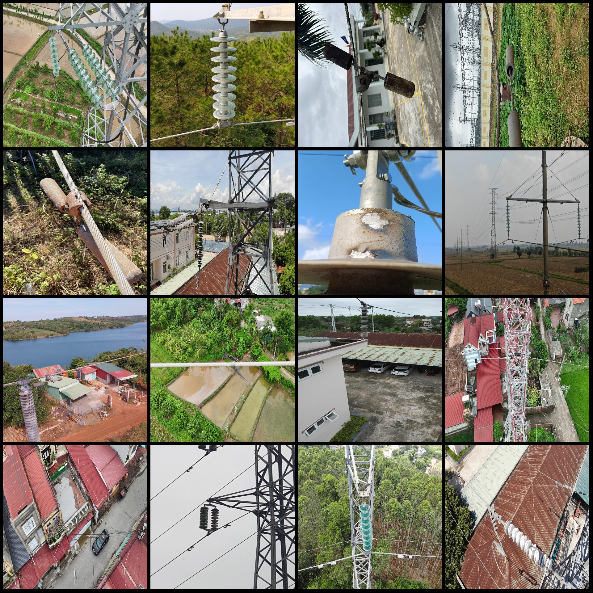
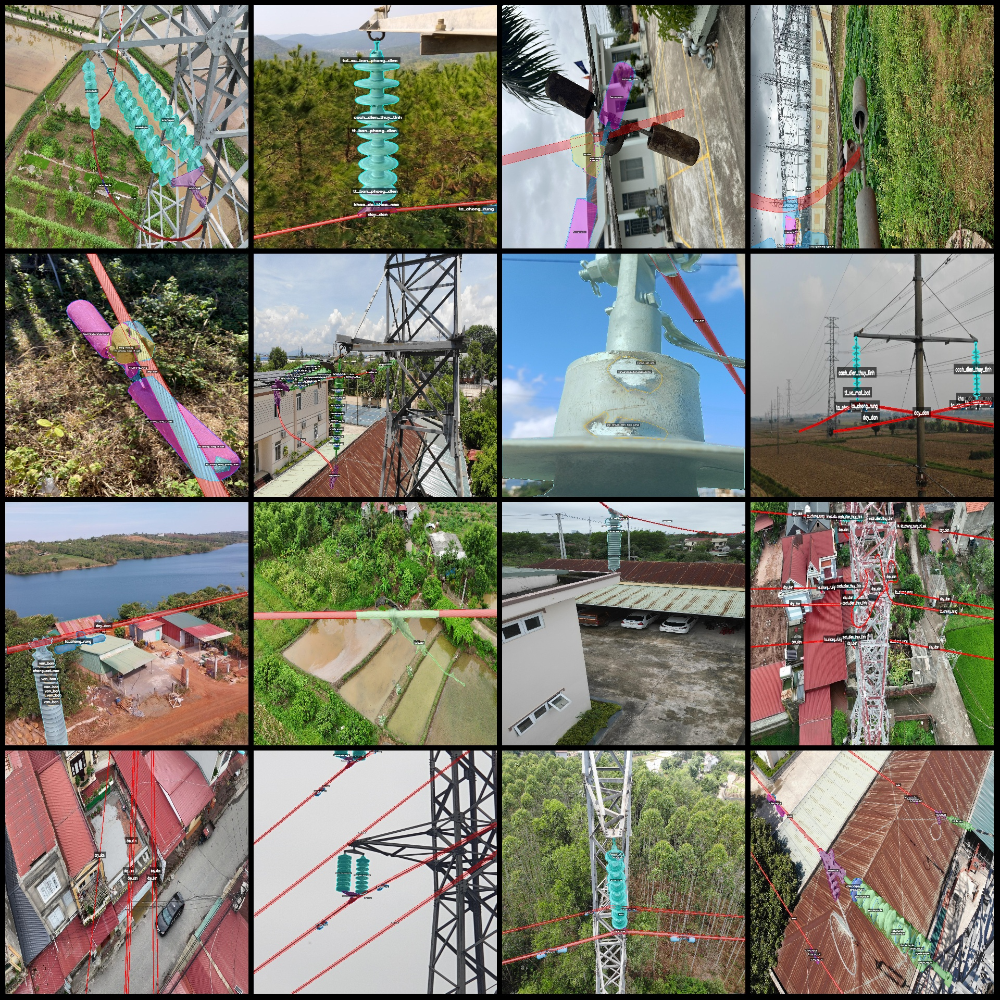
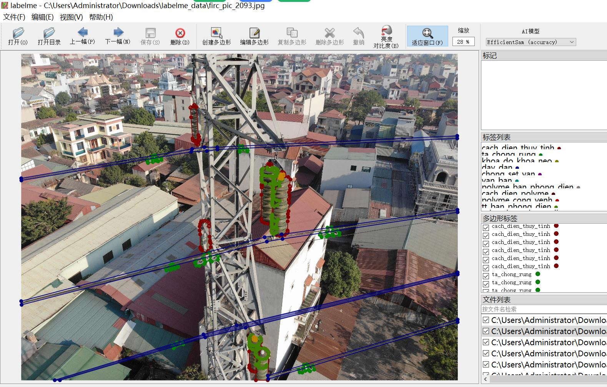

# UAV drone inspection and fault identification dataset for high-voltage transmission lines in power scenarios with 34,542 images in labelme format, 23 categories

## Dataset Format
- **Label file (labelme format)**: Does not include mask files, only contains jpg images and corresponding json files.
- **image**: 3454 images
- **annotation**: 3454 images
- **Number of categories**: 23
- **annotation class names**: ["cach_dien_polyme", "cach_dien_thuy_tinh", "chong_set_van", "day_ban_phong_dien", "day_dan", "day_tua_dut_soi", "day_vat_la_bam", "khoa_do_khoa_neo", "long_bulong", "mat_bulong", 
"mat_ta", "polyme_ban_phong_dien", "polyme_cong_venh", "polyme_rach", "ta_chong_rung", "ta_chong_rung_phong_dien", "ta_chong_rung_ri_set", "toi_su_ban_phong_dien", "tt_ban_phong_dien", 
"tt_vo_mat_bat", "van_ban", "van_phong_dien_bien_dang", "van_ran_rach_tan"]
- **Number of boxes per class annotation**: Not listed

The annotation rules description refers to the instructions or guidelines provided for how annotators are expected to interpret and categorize information or data. These rules may include specific criteria for identifying relevant content, determining the appropriateness of the annotation, and ensuring consistency in the annotation process. The purpose of these rules is to ensure that the annotators have a clear understanding of what they need to do and how to do it effectively.
For each category, draw a polygon.

### Importance Note
This dataset does not guarantee the accuracy of the trained model or weight files.

### Images Preview
Due to the large size of the dataset, it is not possible to show all images here. Please view the original images and annotation results in labelme for more detailed information.

### Annotation Example
For example, for the category "cach_dien_polyme", there may be an annotation example as follows:
```json
{
    "imagePath": "path/to/image.jpg",
    "category": "cach_dien_polyme",
    "boxes": [
        {
            "xmin": 0,
            "ymin": 0,
            "xmax": 1024,
            "ymax": 768
        },
        {
            "xmin": 1024,
            "ymin": 0,
            "xmax": 1024,
            "ymax": 768
        }
// ... other boxes ...
    ]
}
```
To use labelme tool to open and edit this dataset, you need to follow these steps:
1. Download the labelme tool from the official website.
2. Install the labelme tool on your computer.
3. Load the dataset into the labelme tool.
4. Use the labelme tool's built-in features to edit the data, such as adding labels, removing labels, and changing labels.
5. Save the edited dataset as a new file or export it to another format if needed.
## Images






Here is a pay link on Stripe ( https://buy.stripe.com/3cs8yP7sY87d0vu9AB ). Please contact me lonlonago@foxmail.com after funding $89, and I will send you a complete data files , thank you!

